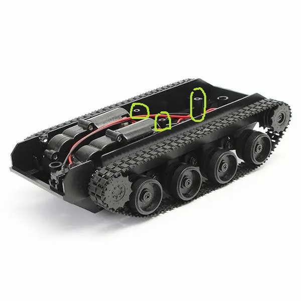
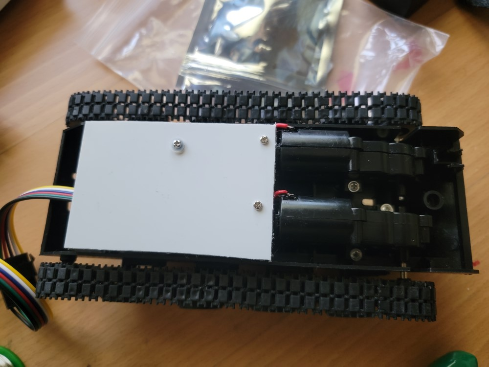

# Top plate for an unfortunate chassis

I've had a misfortune to buy this [3V-7V Light Shock Absorbed Smart Robot Tank Chassis Car DIY Kit With 130 Motor](https://usa.banggood.com/3V-7V-Light-Shock-Absorbed-Smart-Robot-Tank-Chassis-Car-DIY-Kit-With-130-Motor-p-1155263.html). 

The thing comes with no specifications whatsoever. There is no information on how to attach anything to it.

As you can see, there are 3 spacers coming up from the bottom of the chassis: . 

I had to figure out the layout of the spacers and how they relate to the rest of the tank.

## Solution

The proposed [TankTop2.dxf](TankTop2.dxf) file (created with QCAD) is my answer to this issue.

## Notes

The holes are marked with metric diameters, but I actually used nearest imperial drills.

The spacer furthest away from the motors is quite a bit higher than the other two, so I had to drill a large hole to let it through my top. I used 1/8" PVC board for the top. With that, I ended up adding 3 washers under the top to level the board on the high spacer with the two low spacers.

I printed the entire drawing on an index card, then taped it to the PVC board and drilled the holes through the card.

I used M2 screws and an M3 washer under the screw for the large hole.

# Results

This is what the final result looks like: 
